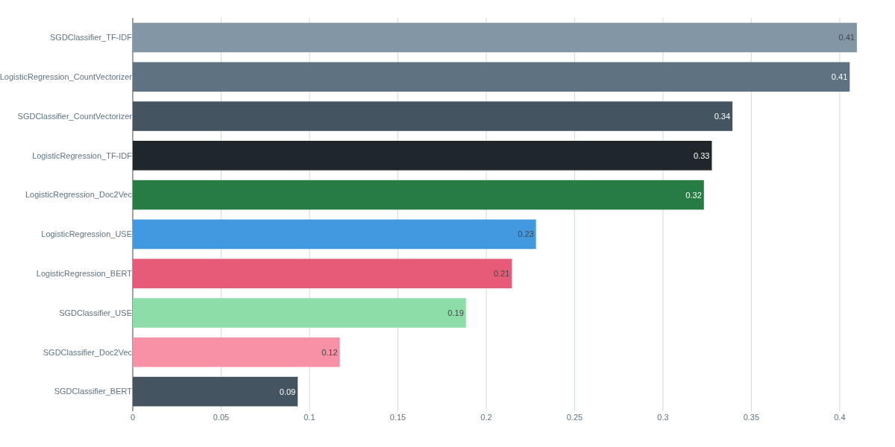

# StackOverflow Tag Suggester

This project is a monorepo containing two main components:
1.  A **FastAPI application** to serve a machine learning model that suggests tags for StackOverflow questions.
2.  A **Streamlit application** to provide a user interface for testing the API.

- 🚀 **Live Demo:** [Try the tag suggester here!](https://ui-p5stackoverflowtags.calmsea-fd4655cf.westeurope.azurecontainerapps.io/)
- 🔌 **API Endpoint:** [Access the root of the API](https://api-p5stackoverflowtags.calmsea-fd4655cf.westeurope.azurecontainerapps.io/)
- 📖 **API Documentation:** [Explore the interactive documentation (Swagger UI)](https://api-p5stackoverflowtags.calmsea-fd4655cf.westeurope.azurecontainerapps.io/docs)

## Model Training

### 1. Dataset

The model was trained on an initial dataset of 50,000 questions from Stack Overflow, extracted using a SQL query on the Stack Exchange Data Explorer.

```sql
SELECT TOP 50000 Id, Title, Body, Tags, Score, ViewCount, AnswerCount, CommentCount, CreationDate
FROM Posts
WHERE PostTypeId = 1
AND Score > 12
AND ViewCount > 100
AND AnswerCount > 0
AND CommentCount > 0
AND LEN(Tags) - LEN(REPLACE(Tags, '<', '')) >= 5
```

### 2. Features Extraction

Several feature extraction techniques were explored to convert the text data into numerical vectors:
- **Bag-of-Words:** Using both `CountVectorizer` and `TF-IDF` for word frequency and importance.
- **Word & Document Embeddings:** `Doc2Vec` for document-level embeddings.
- **Transformer-based Embeddings:** Pre-trained models like `BERT` and the Universal Sentence Encoder (`USE`).

### 3. Models

These features were used to train different models, primarily `LogisticRegression` and `SGDClassifier`, wrapped in a `OneVsRestClassifier` to handle the multi-label nature of the tags.

The final model was selected based on performance, as shown in the chart below. The combination of `SGDClassifier` with `TF-IDF` features provided one of the best Jaccard Scores and was chosen for its excellent balance of performance and inference speed.



## Project Structure

```
stackoverflow-tags-ai/
├── models/                  # ML models and artifacts
├── pyproject.toml           # Project configuration and dependencies
├── README.md                # This file
└── src/
    ├── api/                 # FastAPI application
    │   ├── main.py
    │   └── lib/
    └── streamlit/           # Streamlit UI
        └── app.py
└── tests/
```

Notes: If running the project locally, folder `models/` has to be added manually. Otherwise it is downloaded while building API image.

## Setup and Installation

This project uses `uv` for package management, but you can also use `pip`.

1.  **Navigate to the project directory:**
    ```bash
    cd stackoverflow-tags-ai
    ```

2.  **Install dependencies in editable mode:**
    This step is crucial. It installs the project in a way that makes the `src` modules available everywhere, enabling clean, absolute imports.
    ```bash
    uv pip install -e .
    ```
    *(If you are using pip, run `pip install -e .`)*

## Running the Applications

You need to run the API and the UI in two separate terminals.

### 1. Run the FastAPI API

From the `stackoverflow-tags-ai` directory, run:
```bash
uvicorn src.api.main:app --reload
```
The API will be available at `http://127.0.0.1:8000`. You can access the interactive documentation at `http://127.0.0.1:8000/docs`.

### 2. Run the Streamlit UI

In a new terminal, from the `stackoverflow-tags-ai` directory, run:
```bash
streamlit run src/streamlit/app.py
```
The user interface will open in your browser, typically at `http://localhost:8501`.

### 3. Running with Docker Compose

Alternatively, you can run both applications using Docker Compose. This is the recommended way for a production-like environment.

1.  **Make sure you have Docker and Docker Compose installed.**

2.  **Build and run the services:**
    From the `stackoverflow-tags-ai` directory, run:
    ```bash
    docker-compose up --build
    ```
    - The API will be available at `http://localhost:8000`.
    - The Streamlit UI will be available at `http://localhost:8501`.

3.  **To stop the services**, press `Ctrl+C` in the terminal where `docker-compose` is running, and then run:
    ```bash
    docker-compose down
    ```
